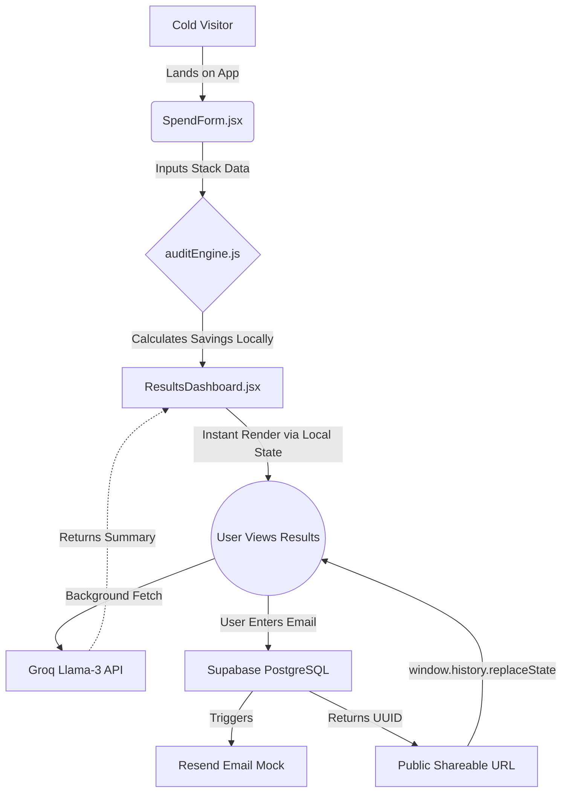

# Architecture & Technical Decisions

SpendSmart is designed as a lightweight, high-conversion single-page application (SPA). The architecture prioritizes "Value-First" user flows, immediate UI responsiveness, and resilient third-party API integrations.

## System Diagram (Mermaid)

## Tech Stack Overview

* **Frontend:** React (Vite) + Tailwind CSS 
* **Routing:** React Router DOM
* **Database / Backend:** Supabase (PostgreSQL)
* **AI Provider:** Groq (Llama 3 8B)
* **Data Visualization:** Chart.js + React-ChartJS-2
* **Transactional Email:** Resend (via emailService.js mock)
* **PDF Generation:** `html-to-image` + `jspdf`

---

## Core Architectural Decisions

### 1. "Value-First" State Management & Routing
**The Problem:** Traditional lead-capture tools force database roundtrips and email verification *before* showing the user their results, resulting in massive drop-off rates.
**The Solution:** SpendSmart completely decouples the audit calculation from the database.
* When a user runs an audit, the state is passed instantly to the `/dashboard` route via local memory (`react-router` state) with zero network latency. 
* The database (`Supabase`) is only pinged at the very end of the funnel when the user explicitly requests a shareable link. 
* We use `window.history.replaceState` to seamlessly upgrade their local URL to a persistent UUID URL without a page reload, creating a frictionless viral loop.

### 2. Resilient AI Integration (Graceful Degradation)
**The Problem:** Third-party LLM APIs are prone to latency spikes and silent timeouts, which can cause loading spinners to hang infinitely.
**The Solution:** The AI summary is wrapped in a strict **`Promise.race` timeout architecture**. 
* The application gives the API exactly 5 seconds to generate the executive summary. 
* If the API fails, hangs, or exceeds the timeout, the `catch` block intercepts the error and instantly injects a deterministic, hardcoded fallback summary based on the financial calculations. 

### 3. Separation of Concerns: The Audit Engine
The business logic (`src/lib/auditEngine.js`) is strictly isolated from the React UI components. 
* **Defensible Heuristics:** The engine relies on hardcoded pricing arrays and multi-variable conditional logic (checking team size, seat usage, and tool overlap arrays simultaneously) rather than relying on an LLM to do math.
* **Testability:** By separating the math from the UI, the engine can be independently tested via Vitest against edge cases without requiring DOM rendering.

### 4. Security & Abuse Prevention
Because this is a public-facing, ungated tool, basic protections were implemented:
* **Honeypot Strategy:** A hidden `<input type="text" name="website" tabIndex="-1">` is embedded in the lead capture form. Automated bots that scrape the DOM and fill out all fields will trigger the honeypot, and the submission is silently rejected.
* **Client-Side API Security:** To prevent API key scraping and CORS violations on the frontend, standard integrations (like transactional emails) are mocked via `emailService.js` with simulated network latency. 

---

## Scaling to 10k Audits per Day

If SpendSmart went viral on HackerNews and had to process 10,000 audits per day, the current architecture would survive (thanks to Vercel's edge caching and Supabase's robust Postgres layer), but I would make the following architectural changes to optimize costs and security:

1. **Move Audit Engine to Edge Functions:** Currently, the pricing arrays and logic sit in the client bundle. At scale, I would move `auditEngine.js` to a Supabase Edge Function or Cloudflare Worker. This hides the proprietary logic from competitors inspecting the browser source code and reduces the client bundle size.
2. **Implement Redis Caching for LLM Calls:** At 10k audits/day, hitting the Groq API for every user would get expensive. Because many companies have the exact same stack (e.g., 5 Copilot seats + 5 ChatGPT seats), I would use Upstash Redis to cache the generated AI summaries based on a hashed string of the user's stack. If a new user inputs an identical stack, we serve the cached summary instantly, bypassing the LLM cost entirely.
3. **Database Rate Limiting:** To protect Supabase from malicious write-heavy attacks, I would implement strict IP-based rate limiting on the lead capture endpoint (e.g., max 3 audit saves per IP address per hour) using Upstash or Vercel Edge Middleware. 
4. **Dedicated Transactional Pipeline:** I would replace the `emailService.js` mock with a dedicated Amazon SES or Postmark pipeline routed through a secure backend worker to handle the volume of confirmation emails without hitting free-tier limits.